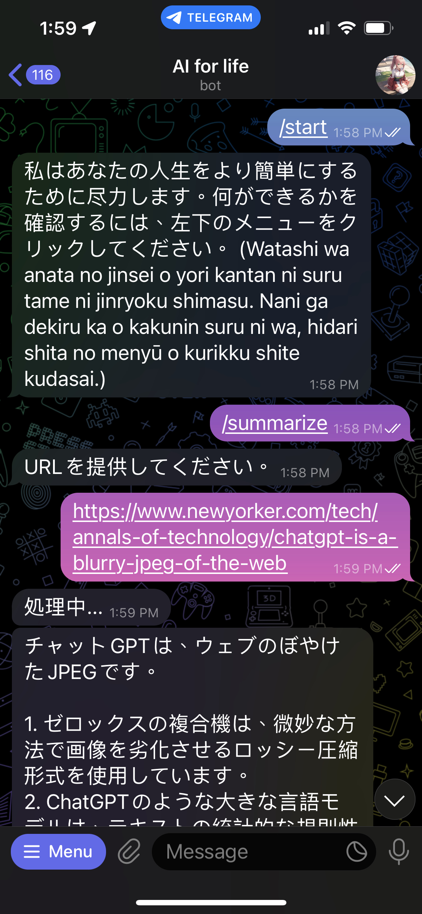

# AI for life

This telegram bot provides various useful tools based on OpenAI. Its purpose is to free our brains from daily chores.

## Features

- Text summarizer - generate key takeaways from an URL
- To be developed...

## Usage

| Environment Variable | Description |
|----------------------|-------------|
| OPENAI_API_KEY       | API key for OpenAI GPT API (required) |
| OPENAI_MODEL         | Model to use for text summarization (default: gpt-3.5-turbo) |
| TELEGRAM_TOKEN       | Token for Telegram API (required) |
| TS_LANG              | Language of the text to be summarized (default: English) |


```sh
docker run -d -e OPENAI_API_KEY=$YOUR_API_KEY -e TELEGRAM_TOKEN=$YOUR_TOKEN -e TS_LANG=$YOUR_LANGUAGE tonypai/ai-for-life
```

## Demo

